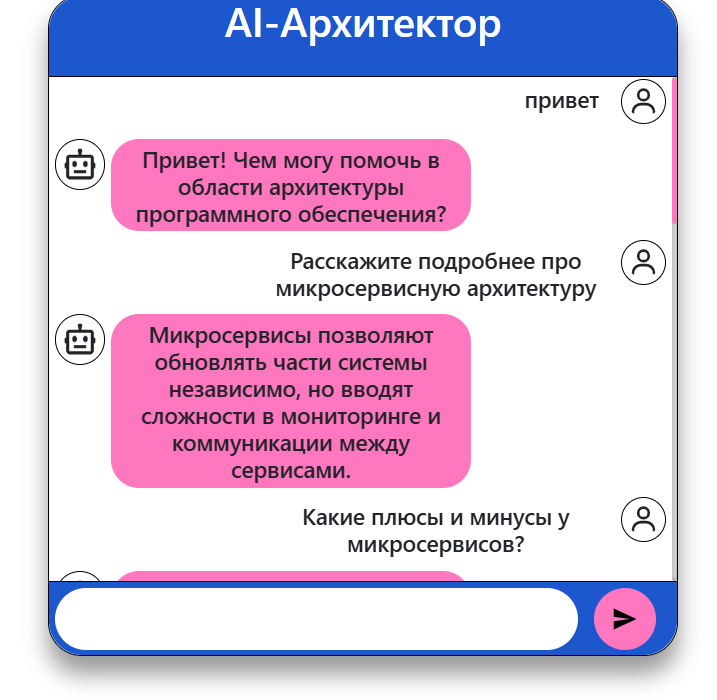

# Решение по чат-боту

## Ссылка на логи
``./Results``

[Логи](./Results/chat.log)

## Краткая памятка по запуску и обучению

### Запуск и работа с virtual-env:

1. ``python -m ensurepip --upgrade``

2. ``pip install virtualenv``

3. ``python -m venv rasa_env``

4. ``source rasa_env/bin/activate``

### Установка Rasa
1. ``pip install rasa``

2. ``pip install transformers``

3. ``rasa init``

4. ``rasa train --force``

5. ``rasa run --enable-api --cors "*"``

### Фронтенд

1. ``npm i``

2. ``npm build``

3. ``npm start``

